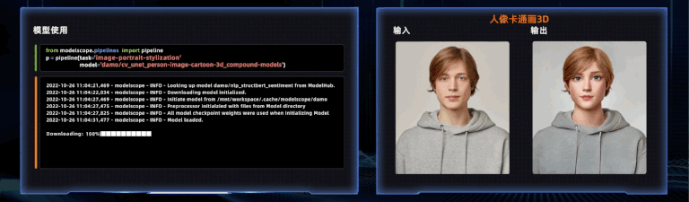

<p align="center">
    <br>
    
    <br>
<p>

<div align="center">

[](https://pypi.org/project/modelscope/)
<!-- [](https://easy-cv.readthedocs.io/en/latest/) -->
[](https://github.com/modelscope/modelscope/blob/master/LICENSE)
[](https://github.com/modelscope/modelscope/issues)
[](https://GitHub.com/modelscope/modelscope/pull/)
[](https://GitHub.com/modelscope/modelscope/commit/)
[](https://opensource.alibaba.com/contribution_leaderboard/details?projectValue=modelscope)

<!-- [](https://GitHub.com/modelscope/modelscope/graphs/contributors/) -->
<!-- [](http://makeapullrequest.com) -->

<h4 align="center">
<a href="https://trendshift.io/repositories/4784" target="_blank"></a>
</h4>

<h4 align="center">
    <p>
        <b>English</b> |
        <a href="https://github.com/modelscope/modelscope/blob/master/README_zh.md">中文</a> |
        <a href="https://github.com/modelscope/modelscope/blob/master/README_ja.md">日本語</a>
    <p>
</h4>


</div>

# Introduction

[ModelScope]( https://www.modelscope.cn) is built upon the notion of “Model-as-a-Service” (MaaS). It seeks to bring together most advanced machine learning models from the AI community, and streamlines the process of leveraging AI models in real-world applications. The core ModelScope library open-sourced in this repository provides the interfaces and implementations that allow developers to perform  model inference, training and evaluation.


In particular, with rich layers of API-abstraction, the ModelScope library offers unified experience to explore state-of-the-art models spanning across domains such as CV, NLP, Speech, Multi-Modality, and Scientific-computation. Model contributors of different areas can integrate models into the ModelScope ecosystem through the layered-APIs, allowing easy and unified access to their models. Once integrated, model inference, fine-tuning, and evaluations can be done with only a few lines of codes. In the meantime, flexibilities are also provided so that different components in the model applications can be customized wherever necessary.

Apart from harboring implementations of a wide range of different models, ModelScope library also enables the necessary interactions with ModelScope backend services, particularly with the Model-Hub and Dataset-Hub. Such interactions facilitate management of  various entities (models and datasets) to be performed seamlessly under-the-hood, including entity lookup, version control, cache management, and many others.

# Models and Online Accessibility

Hundreds of models are made publicly available on [ModelScope]( https://www.modelscope.cn)  (700+ and counting), covering the latest development in areas such as NLP, CV, Audio, Multi-modality, and AI for Science, etc. Many of these models represent the SOTA in their specific fields, and made their open-sourced debut on ModelScope. Users can visit ModelScope([modelscope.cn](http://www.modelscope.cn)) and experience first-hand how these models perform via online experience, with just a few clicks. Immediate developer-experience is also possible through the ModelScope Notebook, which is backed by ready-to-use CPU/GPU development environment in the cloud - only one click away on [ModelScope](https://www.modelscope.cn).


<p align="center">
    <br>
    
    <br>
<p>

Some representative examples include:

LLM:

* [Yi-1.5-34B-Chat](https://modelscope.cn/models/01ai/Yi-1.5-34B-Chat/summary)

* [Qwen1.5-110B-Chat](https://modelscope.cn/models/qwen/Qwen1.5-110B-Chat/summary)

* [DeepSeek-V2-Chat](https://modelscope.cn/models/deepseek-ai/DeepSeek-V2-Chat/summary)

* [Ziya2-13B-Chat](https://modelscope.cn/models/Fengshenbang/Ziya2-13B-Chat/summary)

* [Meta-Llama-3-8B-Instruct](https://modelscope.cn/models/LLM-Research/Meta-Llama-3-8B-Instruct/summary)

* [Phi-3-mini-128k-instruct](https://modelscope.cn/models/LLM-Research/Phi-3-mini-128k-instruct/summary)


Multi-Modal:

* [Qwen-VL-Chat](https://modelscope.cn/models/qwen/Qwen-VL-Chat/summary)

* [Yi-VL-6B](https://modelscope.cn/models/01ai/Yi-VL-6B/summary)

* [InternVL-Chat-V1-5](https://modelscope.cn/models/AI-ModelScope/InternVL-Chat-V1-5/summary)

* [deepseek-vl-7b-chat](https://modelscope.cn/models/deepseek-ai/deepseek-vl-7b-chat/summary)

* [OpenSoraPlan](https://modelscope.cn/models/AI-ModelScope/Open-Sora-Plan-v1.0.0/summary)

* [OpenSora](https://modelscope.cn/models/luchentech/OpenSora-STDiT-v1-HQ-16x512x512/summary)

* [I2VGen-XL](https://modelscope.cn/models/iic/i2vgen-xl/summary)

CV:

* [DamoFD Face Detection Key Point Model - 0.5G](https://modelscope.cn/models/damo/cv_ddsar_face-detection_iclr23-damofd/summary)

* [BSHM Portrait Matting](https://modelscope.cn/models/damo/cv_unet_image-matting/summary)

* [DCT-Net Portrait Cartoonization - 3D](https://modelscope.cn/models/damo/cv_unet_person-image-cartoon-3d_compound-models/summary)

* [DCT-Net Portrait Cartoonization Model - 3D](https://modelscope.cn/models/damo/face_chain_control_model/summary)

* [DuGuang - Text Recognition - Line Recognition Model - Chinese and English - General Domain](https://modelscope.cn/models/damo/cv_convnextTiny_ocr-recognition-general_damo/summary)

* [DuGuang - Text Recognition - Line Recognition Model - Chinese and English - General Domain](https://modelscope.cn/models/damo/cv_resnet18_ocr-detection-line-level_damo/summary)

* [LaMa Image Inpainting](https://modelscope.cn/models/damo/cv_fft_inpainting_lama/summary)


Audio:

* [Paraformer Speech Recognition - Chinese - General - 16k - Offline - Large - Long Audio Version](https://modelscope.cn/models/damo/speech_paraformer-large-vad-punc_asr_nat-zh-cn-16k-common-vocab8404-pytorch/summary)

* [FSMN Voice Endpoint Detection - Chinese - General - 16k - onnx](https://modelscope.cn/models/damo/speech_fsmn_vad_zh-cn-16k-common-onnx/summary)

* [Monotonic-Aligner Speech Timestamp Prediction - 16k - Offline](https://modelscope.cn/models/damo/speech_timestamp_prediction-v1-16k-offline/summary)

* [CT-Transformer Punctuation - Chinese - General - onnx](https://modelscope.cn/models/damo/punc_ct-transformer_zh-cn-common-vocab272727-onnx/summary)

* [Speech Synthesis - Chinese - Multiple Emotions Domain - 16k - Multiple Speakers](https://modelscope.cn/models/damo/speech_sambert-hifigan_tts_zh-cn_16k/summary)

* [CAM++ Speaker Verification - Chinese - General - 200k-Spkrs](https://modelscope.cn/models/damo/speech_campplus_sv_zh-cn_16k-common/summary)


AI for Science:

* [uni-fold-monomer](https://modelscope.cn/models/DPTech/uni-fold-monomer/summary)

* [uni-fold-multimer](https://modelscope.cn/models/DPTech/uni-fold-multimer/summary)

**Note:** Most models on ModelScope are public and can be downloaded without account registration on modelscope website([www.modelscope.cn](www.modelscope.cn)), please refer to instructions for [model download](https://modelscope.cn/docs/%E6%A8%A1%E5%9E%8B%E7%9A%84%E4%B8%8B%E8%BD%BD), for dowloading models with api provided by modelscope library or git.

# QuickTour

We provide unified interface for inference using `pipeline`, fine-tuning and evaluation using `Trainer` for different tasks.

For any given task with any type of input (image, text, audio, video...), inference pipeline can be implemented with only a few lines of code, which will automatically load the underlying model to get inference result, as is exemplified below:

```python
>>> from modelscope.pipelines import pipeline
>>> word_segmentation = pipeline('word-segmentation',model='damo/nlp_structbert_word-segmentation_chinese-base')
>>> word_segmentation('今天天气不错，适合出去游玩')
{'output': '今天 天气 不错 ， 适合 出去 游玩'}
```

Given an image, portrait matting (aka. background-removal) can be accomplished with the following code snippet:


```python
>>> import cv2
>>> from modelscope.pipelines import pipeline

>>> portrait_matting = pipeline('portrait-matting')
>>> result = portrait_matting('https://modelscope.oss-cn-beijing.aliyuncs.com/test/images/image_matting.png')
>>> cv2.imwrite('result.png', result['output_img'])
```

The output image with the background removed is:


Fine-tuning and evaluation can also be done with a few more lines of code to set up training dataset and trainer, with the heavy-lifting work of training and evaluation a model encapsulated in the implementation of  `traner.train()` and
`trainer.evaluate()`  interfaces.

For example, the gpt3 base model (1.3B) can be fine-tuned with the chinese-poetry dataset, resulting in a model that can be used for chinese-poetry generation.

```python
>>> from modelscope.metainfo import Trainers
>>> from modelscope.msdatasets import MsDataset
>>> from modelscope.trainers import build_trainer

>>> train_dataset = MsDataset.load('chinese-poetry-collection', split='train'). remap_columns({'text1': 'src_txt'})
>>> eval_dataset = MsDataset.load('chinese-poetry-collection', split='test').remap_columns({'text1': 'src_txt'})
>>> max_epochs = 10
>>> tmp_dir = './gpt3_poetry'

>>> kwargs = dict(
     model='damo/nlp_gpt3_text-generation_1.3B',
     train_dataset=train_dataset,
     eval_dataset=eval_dataset,
     max_epochs=max_epochs,
     work_dir=tmp_dir)

>>> trainer = build_trainer(name=Trainers.gpt3_trainer, default_args=kwargs)
>>> trainer.train()
```

# Why should I use ModelScope library

1. A unified and concise user interface is abstracted for different tasks and different models. Model inferences and training can be implemented by as few as 3 and 10 lines of code, respectively. It is convenient for users to explore models in different fields in the ModelScope community. All models integrated into ModelScope are ready to use, which makes it easy to get started with AI, in both educational and industrial settings.

2. ModelScope offers a model-centric development and application experience. It streamlines the support for model training, inference, export and deployment, and facilitates users to build their own MLOps based on the ModelScope ecosystem.

3. For the model inference and training process, a modular design is put in place, and a wealth of functional module implementations are provided, which is convenient for users to customize their own model inference, training and other processes.

4. For distributed model training, especially for large models, it provides rich training strategy support, including data parallel, model parallel, hybrid parallel and so on.

# Installation

## Docker

ModelScope Library currently supports popular deep learning framework for model training and inference, including PyTorch, TensorFlow and ONNX. All releases are tested and run on Python 3.7+, Pytorch 1.8+, Tensorflow1.15 or Tensorflow2.0+.

To allow out-of-box usage for all the models on ModelScope, official docker images are provided for all releases. Based on the docker image, developers can skip all environment installation and configuration and use it directly. Currently, the latest version of the CPU image and GPU image can be obtained from:

CPU docker image
```shell
# py37
registry.cn-hangzhou.aliyuncs.com/modelscope-repo/modelscope:ubuntu20.04-py37-torch1.11.0-tf1.15.5-1.6.1

# py38
registry.cn-hangzhou.aliyuncs.com/modelscope-repo/modelscope:ubuntu20.04-py38-torch2.0.1-tf2.13.0-1.9.5
```

GPU docker image
```shell
# py37
registry.cn-hangzhou.aliyuncs.com/modelscope-repo/modelscope:ubuntu20.04-cuda11.3.0-py37-torch1.11.0-tf1.15.5-1.6.1

# py38
registry.cn-hangzhou.aliyuncs.com/modelscope-repo/modelscope:ubuntu20.04-cuda11.8.0-py38-torch2.0.1-tf2.13.0-1.9.5
```

## Setup Local Python Environment

One can also set up local ModelScope environment using pip and conda.  ModelScope supports python3.7 and above.
We suggest [anaconda](https://docs.anaconda.com/anaconda/install/) for creating local python environment:

```shell
conda create -n modelscope python=3.8
conda activate modelscope
```

PyTorch or TensorFlow can be installed separately according to each model's requirements.
* Install pytorch [doc](https://pytorch.org/get-started/locally/)
* Install tensorflow [doc](https://www.tensorflow.org/install/pip)

After installing the necessary machine-learning framework, you can install modelscope library as follows:

If you only want to play around with the modelscope framework, of trying out model/dataset download, you can install the core modelscope components:
```shell
pip install modelscope
```

If you want to use multi-modal models:
```shell
pip install modelscope[multi-modal]
```

If you want to use nlp models:
```shell
pip install modelscope[nlp] -f https://modelscope.oss-cn-beijing.aliyuncs.com/releases/repo.html
```

If you want to use cv models:
```shell
pip install modelscope[cv] -f https://modelscope.oss-cn-beijing.aliyuncs.com/releases/repo.html
```

If you want to use audio models:
```shell
pip install modelscope[audio] -f https://modelscope.oss-cn-beijing.aliyuncs.com/releases/repo.html
```

If you want to use science models:
```shell
pip install modelscope[science] -f https://modelscope.oss-cn-beijing.aliyuncs.com/releases/repo.html
```

`Notes`:
1. Currently, some audio-task models only support python3.7, tensorflow1.15.4 Linux environments. Most other models can be installed and used on Windows and Mac (x86).

2. Some models in the audio field use the third-party library SoundFile for wav file processing. On the Linux system, users need to manually install libsndfile of SoundFile([doc link](https://github.com/bastibe/python-soundfile#installation)). On Windows and MacOS, it will be installed automatically without user operation. For example, on Ubuntu, you can use following commands:
    ```shell
    sudo apt-get update
    sudo apt-get install libsndfile1
    ```

3. Some models in computer vision need mmcv-full, you can refer to mmcv [installation guide](https://github.com/open-mmlab/mmcv#installation), a minimal installation is as follows:

    ```shell
    pip uninstall mmcv # if you have installed mmcv, uninstall it
    pip install -U openmim
    mim install mmcv-full
    ```


# Learn More

We  provide additional documentations including:
* [More detailed Installation Guide](https://modelscope.cn/docs/%E7%8E%AF%E5%A2%83%E5%AE%89%E8%A3%85)
* [Introduction to tasks](https://modelscope.cn/docs/%E4%BB%BB%E5%8A%A1%E7%9A%84%E4%BB%8B%E7%BB%8D)
* [Use pipeline for model inference](https://modelscope.cn/docs/%E6%A8%A1%E5%9E%8B%E7%9A%84%E6%8E%A8%E7%90%86Pipeline)
* [Finetuning example](https://modelscope.cn/docs/%E6%A8%A1%E5%9E%8B%E7%9A%84%E8%AE%AD%E7%BB%83Train)
* [Preprocessing of data](https://modelscope.cn/docs/%E6%95%B0%E6%8D%AE%E7%9A%84%E9%A2%84%E5%A4%84%E7%90%86)
* [Evaluation](https://modelscope.cn/docs/%E6%A8%A1%E5%9E%8B%E7%9A%84%E8%AF%84%E4%BC%B0)
* [Contribute your own model to ModelScope](https://modelscope.cn/docs/ModelScope%E6%A8%A1%E5%9E%8B%E6%8E%A5%E5%85%A5%E6%B5%81%E7%A8%8B%E6%A6%82%E8%A7%88)

# License

This project is licensed under the [Apache License (Version 2.0)](https://github.com/modelscope/modelscope/blob/master/LICENSE).
