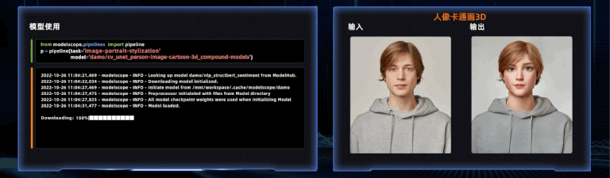

<p align="center">
    <br>
    
    <br>
<p>

<div align="center">

[](https://pypi.org/project/modelscope/)
<!-- [](https://easy-cv.readthedocs.io/en/latest/) -->
[](https://github.com/modelscope/modelscope/blob/master/LICENSE)
[](https://github.com/modelscope/modelscope/issues)
[](https://GitHub.com/modelscope/modelscope/pull/)
[](https://GitHub.com/modelscope/modelscope/commit/)
[](https://opensource.alibaba.com/contribution_leaderboard/details?projectValue=modelscope)

<!-- [](https://GitHub.com/modelscope/modelscope/graphs/contributors/) -->
<!-- [](http://makeapullrequest.com) -->

<h4 align="center">
    <p>
      <a href="https://github.com/modelscope/modelscope/blob/master/README.md">English</a> |
       <b>中文</b>
    <p>
</h4>


</div>

# 简介

[ModelScope]( https://www.modelscope.cn) 是一个“模型即服务”(MaaS)平台，旨在汇集来自AI社区的最先进的机器学习模型，并简化在实际应用中使用AI模型的流程。ModelScope库使开发人员能够通过丰富的API设计执行推理、训练和评估，从而促进跨不同AI领域的最先进模型的统一体验。

ModelScope Library为模型贡献者提供了必要的分层API，以便将来自 CV、NLP、语音、多模态以及科学计算的模型集成到ModelScope生态系统中。所有这些不同模型的实现都以一种简单统一访问的方式进行封装，用户只需几行代码即可完成模型推理、微调和评估。同时，灵活的模块化设计使得在必要时也可以自定义模型训练推理过程中的不同组件。

除了包含各种模型的实现之外，ModelScope Library还支持与ModelScope后端服务进行必要的交互，特别是与Model-Hub和Dataset-Hub的交互。这种交互促进了模型和数据集的管理在后台无缝执行，包括模型数据集查询、版本控制、缓存管理等。

# 部分模型和在线体验
ModelScope开源了数百个(当前700+)模型，涵盖自然语言处理、计算机视觉、语音、多模态、科学计算等，其中包含数百个SOTA模型。用户可以进入ModelScope网站([modelscope.cn](http://www.modelscope.cn))的模型中心零门槛在线体验，或者Notebook方式体验模型。

<p align="center">
    <br>
    
    <br>
<p>

示例如下:

自然语言处理：

* [GPT-3预训练生成模型-中文-2.7B](https://modelscope.cn/models/damo/nlp_gpt3_text-generation_2.7B)

* [元语功能型对话大模型](https://modelscope.cn/models/ClueAI/ChatYuan-large)

* [孟子T5预训练生成模型-中文-base](https://modelscope.cn/models/langboat/mengzi-t5-base)

* [CSANMT连续语义增强机器翻译-英中-通用领域-large](https://modelscope.cn/models/damo/nlp_csanmt_translation_en2zh)

* [RaNER命名实体识别-中文-新闻领域-base](https://modelscope.cn/models/damo/nlp_raner_named-entity-recognition_chinese-base-news)

* [BAStructBERT分词-中文-新闻领域-base](https://modelscope.cn/models/damo/nlp_structbert_word-segmentation_chinese-base)

* [二郎神-RoBERTa-330M-情感分类](https://modelscope.cn/models/fengshenbang/Erlangshen-RoBERTa-330M-Sentiment)

* [SPACE-T表格问答预训练模型-中文-通用领域-base](https://modelscope.cn/models/damo/nlp_convai_text2sql_pretrain_cn)

多模态：

* [CLIP模型-中文-通用领域-base](https://modelscope.cn/models/damo/multi-modal_clip-vit-base-patch16_zh)

* [OFA预训练模型-中文-通用领域-base](https://modelscope.cn/models/damo/ofa_pretrain_base_zh)

* [太乙-Stable-Diffusion-1B-中文-v0.1](https://modelscope.cn/models/fengshenbang/Taiyi-Stable-Diffusion-1B-Chinese-v0.1)

* [mPLUG视觉问答模型-英文-large](https://modelscope.cn/models/damo/mplug_visual-question-answering_coco_large_en)

计算机视觉：

* [ControlNet可控图像生成](https://modelscope.cn/models/dienstag/cv_controlnet_controllable-image-generation_nine-annotators/summary)

* [DAMOYOLO-高性能通用检测模型-S](https://modelscope.cn/models/damo/cv_tinynas_object-detection_damoyolo)

* [DCT-Net人像卡通化](https://modelscope.cn/models/damo/cv_unet_person-image-cartoon_compound-models)

* [读光-文字识别-行识别模型-中英-通用领域](https://modelscope.cn/models/damo/cv_convnextTiny_ocr-recognition-general_damo)

* [人体检测-通用-Base](https://modelscope.cn/models/damo/cv_resnet18_human-detection)

* [RetinaFace人脸检测关键点模型](https://modelscope.cn/models/damo/cv_resnet50_face-detection_retinaface)

* [BSHM人像抠图](https://modelscope.cn/models/damo/cv_unet_image-matting)

* [图像分割-商品展示图场景的商品分割-电商领域](https://modelscope.cn/models/damo/cv_F3Net_product-segmentation)

* [万物识别-中文-通用领域](https://modelscope.cn/models/damo/cv_resnest101_general_recognition)


语音：

* [Paraformer语音识别-中文-通用-16k-离线-large-pytorch](https://modelscope.cn/models/damo/speech_paraformer-large_asr_nat-zh-cn-16k-common-vocab8404-pytorch)

* [语音合成-中文-多情感领域-16k-多发音人](https://modelscope.cn/models/damo/speech_sambert-hifigan_tts_zh-cn_16k)

* [CTC语音唤醒-移动端-单麦-16k-小云小云](https://modelscope.cn/models/damo/speech_charctc_kws_phone-xiaoyun)

* [WeNet-U2pp_Conformer-语音识别-中文-16k-实时](https://modelscope.cn/models/wenet/u2pp_conformer-asr-cn-16k-online)

* [FRCRN语音降噪-单麦-16k](https://modelscope.cn/models/damo/speech_frcrn_ans_cirm_16k)

* [DFSMN回声消除-单麦单参考-16k](https://modelscope.cn/models/damo/speech_dfsmn_aec_psm_16k)


科学计算：

* [Uni-Fold-Monomer 开源的蛋白质单体结构预测模型](https://modelscope.cn/models/DPTech/uni-fold-monomer/summary)

* [Uni-Fold-Multimer 开源的蛋白质复合物结构预测模型](https://modelscope.cn/models/DPTech/uni-fold-multimer/summary)

# 快速上手

我们针对不同任务提供了统一的使用接口， 使用`pipeline`进行模型推理、使用`Trainer`进行微调和评估。

对于任意类型输入（图像、文本、音频、视频...）的任何任务，只需3行代码即可加载模型并获得推理结果，如下所示：
```python
>>> from modelscope.pipelines import pipeline
>>> word_segmentation = pipeline('word-segmentation',model='damo/nlp_structbert_word-segmentation_chinese-base')
>>> word_segmentation('今天天气不错，适合出去游玩')
{'output': '今天 天气 不错 ， 适合 出去 游玩'}
```

给定一张图片，你可以使用如下代码进行人像抠图.


```python
>>> import cv2
>>> from modelscope.pipelines import pipeline

>>> portrait_matting = pipeline('portrait-matting')
>>> result = portrait_matting('https://modelscope.oss-cn-beijing.aliyuncs.com/test/images/image_matting.png')
>>> cv2.imwrite('result.png', result['output_img'])
```
输出图像如下


对于微调和评估模型， 你需要通过十多行代码构建dataset和trainer，调用`trainer.train()`和`trainer.evaluate()`即可。

例如我们利用gpt3 1.3B的模型，加载是诗歌数据集进行finetune，可以完成古诗生成模型的训练。
```python
>>> from modelscope.metainfo import Trainers
>>> from modelscope.msdatasets import MsDataset
>>> from modelscope.trainers import build_trainer

>>> train_dataset = MsDataset.load('chinese-poetry-collection', split='train'). remap_columns({'text1': 'src_txt'})
>>> eval_dataset = MsDataset.load('chinese-poetry-collection', split='test').remap_columns({'text1': 'src_txt'})
>>> max_epochs = 10
>>> tmp_dir = './gpt3_poetry'

>>> kwargs = dict(
     model='damo/nlp_gpt3_text-generation_1.3B',
     train_dataset=train_dataset,
     eval_dataset=eval_dataset,
     max_epochs=max_epochs,
     work_dir=tmp_dir)

>>> trainer = build_trainer(name=Trainers.gpt3_trainer, default_args=kwargs)
>>> trainer.train()
```

# 为什么要用ModelScope library

1. 针对不同任务、不同模型抽象了统一简洁的用户接口，3行代码完成推理，10行代码完成模型训练，方便用户使用ModelScope社区中多个领域的不同模型，开箱即用，便于AI入门和教学。

2. 构造以模型为中心的开发应用体验，支持模型训练、推理、导出部署，方便用户基于ModelScope Library构建自己的MLOps.

3. 针对模型推理、训练流程，进行了模块化的设计，并提供了丰富的功能模块实现，方便用户定制化开发来自定义自己的推理、训练等过程。

4. 针对分布式模型训练，尤其是大模型，提供了丰富的训练策略支持，包括数据并行、模型并行、混合并行等。

# 安装

## 镜像
ModelScope Library目前支持tensorflow，pytorch深度学习框架进行模型训练、推理， 在Python 3.7+, Pytorch 1.8+, Tensorflow1.15/Tensorflow2.0+测试可运行。

为了让大家能直接用上ModelScope平台上的所有模型，无需配置环境，ModelScope提供了官方镜像，方便有需要的开发者获取。地址如下：

CPU镜像
```shell
registry.cn-hangzhou.aliyuncs.com/modelscope-repo/modelscope:ubuntu20.04-py37-torch1.11.0-tf1.15.5-1.3.0
```

GPU镜像
```shell
registry.cn-hangzhou.aliyuncs.com/modelscope-repo/modelscope:ubuntu20.04-cuda11.3.0-py37-torch1.11.0-tf1.15.5-1.3.0
```

## 搭建本地Python环境

你也可以使用pip和conda搭建本地python环境，我们推荐使用[Anaconda](https://docs.anaconda.com/anaconda/install/)，安装完成后，执行如下命令为modelscope library创建对应的python环境：
```shell
conda create -n modelscope python=3.7
conda activate modelscope
```

接下来根据所需使用的模型依赖安装底层计算框架
* 安装Pytorch [文档链接](https://pytorch.org/get-started/locally/)
* 安装tensorflow [文档链接](https://www.tensorflow.org/install/pip)


安装完前置依赖，你可以按照如下方式安装ModelScope Library。

ModelScope Libarary由核心框架，以及不同领域模型的对接组件组成。如果只需要ModelScope模型和数据集访问等基础能力，可以只安装ModelScope的核心框架：
```shell
pip install modelscope
```

如仅需体验多模态领域的模型，可执行如下命令安装领域依赖：
```shell
pip install modelscope[multi-modal]
```

如仅需体验NLP领域模型，可执行如下命令安装领域依赖（因部分依赖由ModelScope独立host，所以需要使用"-f"参数）：
```shell
pip install modelscope[nlp] -f https://modelscope.oss-cn-beijing.aliyuncs.com/releases/repo.html
```

If you want to use cv models:
```shell
pip install modelscope[cv] -f https://modelscope.oss-cn-beijing.aliyuncs.com/releases/repo.html
```

如仅需体验语音领域模型，可执行如下命令安装领域依赖（因部分依赖由ModelScope独立host，所以需要使用"-f"参数）：
```shell
pip install modelscope[audio] -f https://modelscope.oss-cn-beijing.aliyuncs.com/releases/repo.html
```

`注意`：当前大部分语音模型需要在Linux环境上使用，并且推荐使用python3.7 + tensorflow 1.x的组合。

如仅需体验科学计算领域模型，可执行如下命令安装领域依赖（因部分依赖由ModelScope独立host，所以需要使用"-f"参数）：
```shell
pip install modelscope[science] -f https://modelscope.oss-cn-beijing.aliyuncs.com/releases/repo.html
```

`注`:
1. 目前部分语音相关的模型仅支持 python3.7,tensorflow1.15.4的Linux环境使用。 其他绝大部分模型可以在windows、mac（x86）上安装使用。.

2. 语音领域中一部分模型使用了三方库SoundFile进行wav文件处理，在Linux系统上用户需要手动安装SoundFile的底层依赖库libsndfile，在Windows和MacOS上会自动安装不需要用户操作。详细信息可参考[SoundFile 官网](https://github.com/bastibe/python-soundfile#installation)。以Ubuntu系统为例，用户需要执行如下命令:
    ```shell
    sudo apt-get update
    sudo apt-get install libsndfile1
    ```

3. CV领域的少数模型，需要安装mmcv-full， 如果运行过程中提示缺少mmcv，请参考mmcv[安装手册](https://github.com/open-mmlab/mmcv#installation)进行安装。 这里提供一个最简版的mmcv-full安装步骤，但是要达到最优的mmcv-full的安装效果（包括对于cuda版本的兼容），请根据自己的实际机器环境，以mmcv官方安装手册为准。
    ```shell
    pip uninstall mmcv # if you have installed mmcv, uninstall it
    pip install -U openmim
    mim install mmcv-full
    ```


# 更多教程

除了上述内容，我们还提供如下信息：
* [更加详细的安装文档](https://modelscope.cn/docs/%E7%8E%AF%E5%A2%83%E5%AE%89%E8%A3%85)
* [任务的介绍](https://modelscope.cn/docs/%E4%BB%BB%E5%8A%A1%E7%9A%84%E4%BB%8B%E7%BB%8D)
* [模型推理](https://modelscope.cn/docs/%E6%A8%A1%E5%9E%8B%E7%9A%84%E6%8E%A8%E7%90%86Pipeline)
* [模型微调](https://modelscope.cn/docs/%E6%A8%A1%E5%9E%8B%E7%9A%84%E8%AE%AD%E7%BB%83Train)
* [数据预处理](https://modelscope.cn/docs/%E6%95%B0%E6%8D%AE%E7%9A%84%E9%A2%84%E5%A4%84%E7%90%86)
* [模型评估](https://modelscope.cn/docs/%E6%A8%A1%E5%9E%8B%E7%9A%84%E8%AF%84%E4%BC%B0)
* [贡献模型到ModelScope](https://modelscope.cn/docs/ModelScope%E6%A8%A1%E5%9E%8B%E6%8E%A5%E5%85%A5%E6%B5%81%E7%A8%8B%E6%A6%82%E8%A7%88)

# License

本项目使用[Apache License (Version 2.0)](https://github.com/modelscope/modelscope/blob/master/LICENSE).
